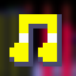

# Extra Invincibility Themes

This mod adds more invincibility & super themes to Sonic 3 AIR.

Thanks to the Sonic 3 A.I.R. community discord server & Sonic 3 A.I.R. forums for theme requests, feedback, and assistance with code.

## Mod Options

**Invincibility Themes**
* 3 A.I.R. Options (Disabled)
* Sonic 1
* Sonic 2
* Sonic CD (US)
* Sonic 4
* Sonic CD (JP/EU)
* Sonic 3D Blast
* Lego Dimensions
* Sonic Adventure
* Sonic Mania
* Knuckles' Chaotix
* SiIvaGunner
* Sonic Forces
* Sonic 3D Blast (Saturn)
* Sonic Generations
* TimmyTurnersGrandDad (NTSC)
* Super Mario World
* Sonic Triple Trouble 16-Bit
* Sonic Megamix (V4)
* Sonic 06

## Mod Credits

**Key Authors**
* [SammyGoesHowdy](https://github.com/SammyGoesHowdy) - Main Scripter

**Special Thanks**
* [kaoshipaws](https://github.com/kaoshipaws) - Help with Extra Slot compatibility

**Original Authors** 
* Masato Nakamura - Sonic 1 invincibility theme, Sonic 2 invincibility theme
* Spencer Nilsen, David Young, Mark Crew - Sonic CD (US) invincibility theme
* Naofumi Hataya, Masafumi Ogata - Sonic CD (JP/EU) invincibility theme
* Jun Senoue - Sonic 4 invincibility theme, Sonic Adventure invincibility theme, Sonic 3D Blast invincibility theme, Sonic Generations invincibility theme
* Tee Lopes - Sonic Mania invincibility theme
* Rob Westwood, Ian Livingstone, & Matthew Moore - Lego Dimensions invincibility theme
* SiIvaGunner - Sonic 3 invincibility theme
* Tatsuya Kouzaki, Junko Shiratsu, Mariko Nanba - Knuckles' Chaotix invincibility theme
* TimmyTurnersGrandDad - S3 (NTSC) invincibility theme
* Richard Jacques - 3D Blast (Saturn) invincibility theme 
* Tomoya Ohtani, Naofumi Hataya, Kenichi Tokoi, Takahito Eguchi - Sonic Forces invincibility theme
* Noah N. Copeland - Sonic Triple Trouble - 16-Bit invincibility theme
* Tomoya Ohtani - Sonic 06 invincibility theme
